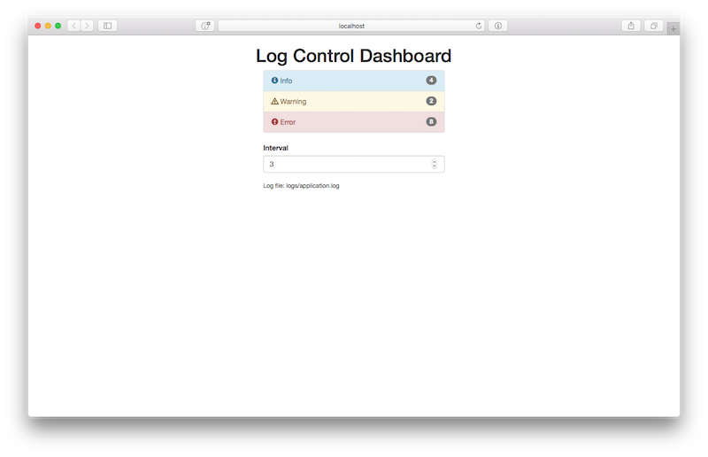

# Log Control Dashboard
Author: Vladimir Livin

Log Control is a web-dashboard widget that aggregates all logging messages
from a logger in real-time and displays how much messages of different 
kind like `INFO`, `ERROR` or `WARNING`'s was logged in the last `monitoring interval` seconds.

Interval can be changed by a user in real-time. App uses sample DemoLogger
that generates random messages. Communication is done in real-time 
through a web-socket.

The app shows how a scalable reusable widget can be made communicating
with user using Akka Actors and Websockets.

Here's a feel what app looks like.



It features following stack:
 - Backend: Play Framework 2.6
 - Real-time scallable messaging: Akka Actors
 - Frontend: Vue JS 2.4, Bootstrap, Websockets 

## Installation

### Prerequisites

- Java 8+ is required
- SBT

### Using binary release

1. Unpack `logcontrol-1.0-SNAPSHOT.zip`
2. cd `logcontrol-1.0-SNAPSHOT`
3. Running:
   `bin/logcontrol` (for Mac/Linux) 
   `bin\logcontrol.bat` (for Windows).
4. Open http://localhost:9000

### Using sources 

1. Unpack `logcontrol.zip`
2. Install `sbt` from http://www.scala-sbt.org
3. cd to `logcontrol` dir.
4. Run `sbt run` 

## Configuration

Configuration is located in `conf/application.conf`.

### Logging file path

To configure logging file path use `logpath` configuration propererty.

Ex.:

```
logpath="logs/application.log"
```

Specify either absolute path or a path relative to the root directory of installation.

### Demo Logger

By default demo logger will be used to write to `logs/application.log`.
To to turn off demo logger use option:

```
demoLogger.enable=false
```

### Default Monitoring Interval

To set the default monitoring interval (in seconds) use following option:

```
interval=5
```

## Testing

We've following tests which verifies that functionality works ok:

1. `LogRecordTest` - verifies that log record is parsed properly.
2. `LogSummaryTest` - verifies that log summary is aggregating properly during addition of new records. 

